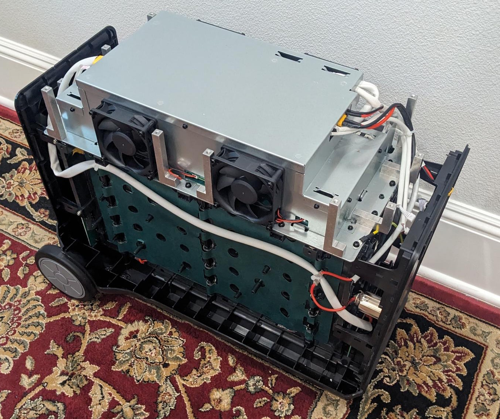
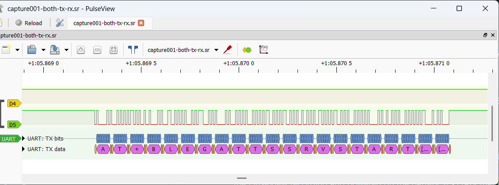

# Power Station Internals

I have a AFERIY P310 that is stuck in a reboot loop, likely because a bad setting was sent to the device using Bluetooth. This is a really sad thing about these devices, anyone with a cellphone in proximity of this battery could, without any authentication, send a bad command to the battery to cause it to go into a reboot loop basically bricking it. On this page, we will be taking a look at the internals of the device and how it works.

## Opening the Battery

Obviously, this is a battery with a lot of power and a huge inverter so, be super careful when doing this. The first step to to remove the top of the device. There are a set of rubber plugs and two rubber strips that are easy to remove. After that, remove all of the screws and take off the top of the device. I then you can removed the sides but this may not be needed because depending on what you do, you may have access to the pins you want to monitor. The sides are a bit more difficult to remove as there are healed at two snap-in locations at the bottom. Once you know these locations it's easier to un-snap and pull up. There is the battery with the top and sides removed.



I kept a small bag with all of the screws. Luckly it's very clear what goes where. If you take your voltmeter out and test around, you will see there are two bars that are exposed with 48v on them. So again, be super careful if you do this. In my case, I then took the front motherboard out.

## Looking at the Motherboard

There is while glue used to make sure nothing gets disconnected during transport which is easy to remove. You have to disconnect 3 white connectors and 1 power connection from the main board. All the connectors are a bit different so, it's not possible to put them back incorrectly which is nice. Here is a picture of the main board:


I have [other pictures of the motherboard here](https://github.com/Ylianst/ESP-FBot/tree/main/internals/boardimages). At the bottom of the board, I see the following indication:


It says "SYD-N051-DC-V1.5" on the first line and "20230915" on the second line. You can immidiately see that this is a board from [Shenzhen SYD Network Technology Co. Ltd.](https://sydpower.com/) and on their web site there is a range of power stations that you can get and brand anyway you like. This is the original source of the battery with AFERIY and others re-branding it.

It looks like the board is run by an ARM Cortex processor, but you can see that they took extra care to black out all of the chips so to make them more difficult to identify. On the top left is the typical ARM debug port with 4 connectors (3.3v, GND, SWCLK, SWDIO on the J13 connector).


Here is a IA guess at where the two main chips on the board are:

- U11, GD32F303 series microcontroller (likely a GD32F303RBT6).
- U14, GD32F130 series microcontroller (likely a GD32F130G6 in a 28-pin SOP package).

This is typically a Serial Wire Debug (SWD) for ARM Cortex processors. It's typically used to flash and debug the ARM processor. On the top right of the motherboard is the ESP32 chip that does WIFI and Bluetooth. The 2.4Ghz antenna is the small wiggle in the black area.


This is a `ESP32-C3-MINI-1 M4N4`, you can find the [documentation for this chip here](https://documentation.espressif.com/esp32-c3-mini-1_datasheet_en.pdf). Going with a voltmeter and just testing the pins along with looking at the location of the pins on the ESP32-C3-MINI-1, I think this are the pin connections for the ESP32:

```
    Ground *   * Ground
      3.3v *   * Ground
    Ground *   * Ground
EN (Reset) *   * 21 UART TX   <-- ESP32 to ARM
    Ground *   * 20 UART RX   <-- ARM to ESP32
```

While there are 10 pins connects to the ESP32, there are only really 5: Ground, 3.3v, Enable, TX and RX.

## ARM to ESP32 Communication

I put the motherboard back into the battery and used a [cheap 10$ USB logic analyser](https://www.amazon.com/dp/B0CHZ13R6D) to spy on the communication between the ARM and ESP32 using software called [PulseView](https://sigrok.org/wiki/PulseView). With one hand, I pushed the channel 4 and 5 of the logic analyser wires to the UART RX and TX, started the PluseView recording and powered on the battery. It's crazy that it worked, but it did. You can then easily decode the messages between both chips.



You can find my [PulseView capture files here](https://github.com/Ylianst/ESP-FBot/tree/main/internals/pulseview). "Capture001" was my first succesful capture of both TX and RX pins at a sampling rate that is way too high since I did not know what I would except. D4 is from the ARM to the ESP32, and D5 are the responses from the ESP32.

It turns out the ARM Cortex chip talks to the ESP32 using standard 115200,N,8,1 serial settings and using standard "AT" commands. It seems like the ESP32 is loaded with a standard "proxy" firmware from Espressif and documentation of the AT commands is here: [Espressif AT Command Set](https://docs.espressif.com/projects/esp-at/en/latest/esp32/AT_Command_Set/Basic_AT_Commands.html) In PulseView, you can use the UART decoder to see all of the messages.

So, the ARM chip instructs the ESP32 to enable it's Bluetooth, WIFI and more over a standard serial port. All the AT commands are in ASCII format and easy to read and understand. Here is the initial conversation between the ARM chip and the ESP32, this gets the Bluetooth ready for connections. I added "ARM:" for commands sent by the ARM chip to the ESP32 and "ESP:" for data coming from the ESP32.

```
ARM: AT+RST\r\n                          <-- ARM tells the ESP32 to restart
ESP: \r\nready\r\n                       <-- ESP32 is ready
ARM: AT\r\n                              <-- Simple ping/pong
ESP: AT\r\n
ESP: \r\nOK\r\n
ARM: AT+BLEINIT=2\r\n                    <-- Initializes the BLE stack. The value 2 sets the ESP32 as a Server.
ESP: AT+BLEINIT=2\r\n
ESP: \r\nOK\r\n
ARM: AT+SYSMSG=7\r\n                     <-- Value 7 tells the ESP32 to notify the ARM chip about BLE connection and disconnection events.
ESP: AT+SYSMSG=7\r\n
ESP: \r\nOK\r\n
ARM: AT+CWRECONNCFG=10,0\r\n             <-- Wi-Fi command, try reconnecting to Wi-Fi 10 times if it loses a connection.
ESP: AT+CWRECONNCFG=10,0\r\n
ESP: \r\nOK\r\n
ARM: AT+BLEGATTSSRVCRE\r\n               <-- GATT Server Create. This tells the ESP32 to build the database of services in its memory.
ESP: AT+BLEGATTSSRVCRE\r\n
ESP: \r\nOK\r\n
ARM: AT+BLEGATTSSRVSTART\r\n             <-- GATT Server Start. This officially launches the services so they are active and ready for a client to read/write.
ESP: AT+BLEGATTSSRVSTART\r\n
ESP: \r\nOK\r\n
ARM: AT+BLEADDR?\r\n                     <-- ARM requests the Bluetooth MAC address
ESP: AT+BLEADDR?\r\n
ESP: +BLEADDR:"a8:46:74:41:4c:42"\r\nOK\r\n
ARM: AT+BLEADVDATAEX="POWER-7E83","7e83","99A84674414C4200",1\r\n    <-- Broadcast a Bluetooh advertising packets
ESP: AT+BLEADVDATAEX="POWER-7E83","7e83","99A84674414C4200",1\r\n
ESP: \r\nOK\r\n
```

You notice that except for the initial reset command, the ESP32 will echo back the command it received from the ARM chip and then respond to it. You can see a bunch of "BLE" (Bluetooth) messages to get Bluetooth started. At this point, the battery is ready to receive Bluetooth messages. Let's now see what connecting a Bluetooth clients does. I am going to use a HomeAssistant ESP-FBot ESP32 as client to connect to the battery:

```
ESP: +BLECONN:0,"f0:24:f9:bb:d3:ca"\r\n          <-- Bluetooth client connection

ARM: AT+BLEGATTSNTFY=0,1,6,168\r\n               <-- Client get initial block of data
ESP: AT+BLEGATTSNTFY=0,1,6,168\r\n>
ARM: (168 bytes of binary data)
ESP: \r\nOK\r\n

ESP: +BLECFGMTU:0,517\r\n                        <-- Client configures MTU to 517 bytes

(This is a typical user command, like turn the battery's light on, off, etc)
ESP: +WRITE:0,1,5,,8,(8 bytes of binary data, last 2 are CRC)\r\n
ARM: AT+BLEGATTSNTFY=0,1,6,168\r\n
ESP: AT+BLEGATTSNTFY=0,1,6,168\r\n>
ARM: (168 bytes of binary data, last 2 are CRC)
ESP: \r\nOK\r\n

ESP: +BLEDISCONN:0,"f0:24:f9:bb:d3:ca"\r\n       <-- Bluetooth client disconnects
```

So, we have our Bluetooth client connecting, setting the MTU which is the "Maximum Transfer Unit" which is the largest packet it will accept. Then, you get a block of 168 bytes of data and the client can write data and get an updated state of 168 bytes. The next step is to look into the binary writes and notifications. Here is a typical "Write" and the response.

```
ESP: +WRITE:0,1,5,,8,[11 04 00 00 00 50 A6 F2]\r\n   <-- Last 2 bytes are the CRC
ARM: AT+BLEGATTSNTFY=0,1,6,168\r\n
ESP: AT+BLEGATTSNTFY=0,1,6,168\r\n>
ARM: (Sends 168 bytes of data, last 2 bytes are the CRC)
04 00 00 00 50 00 00 00 00 00 02 00 00 00 00 00 
00 00 00 00 00 00 00 00 00 00 00 00 00 00 00 00 
00 00 00 00 00 00 00 00 00 00 AE 02 58 00 00 00 
09 00 00 00 00 00 00 00 00 00 00 00 00 00 00 00 
00 00 00 00 00 00 00 00 00 00 00 00 00 00 00 00 
00 00 00 00 00 00 00 00 00 00 00 00 00 00 00 00 
00 00 00 30 00 40 00 00 00 00 00 00 00 00 00 00 
00 03 14 00 00 03 A5 00 00 00 00 AB F1 00 00 00 
00 00 FF FF FF 00 00 00 00 00 00 00 00 00 00 00 
00 00 00 00 00 00 00 00 00 00 00 00 00 00 00 00 
00 00 00 00 00 8E B8 
ESP: \r\nOK\r\n
```

You can calculate the CRC using the [this CRC online calculator](https://www.codertools.net/tools/crc.php), you need to set the input format to "HEX" and CRC to "CRC-16/MODBUS". Then, paste the entire data packet except the last 2 bytes and you should get the last 2 bytes calculated correctly.

The next step is to document the binary values, but this should match data we are collecting when talking over Bleutooth.